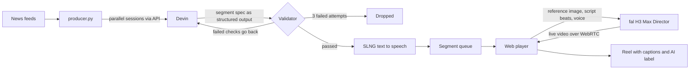

# Nova Cast

A livestream of AI news that runs itself. New stories are picked up from news feeds, Devin writes each segment through the API, a validator in code checks every claim against its source, SLNG gives the presenter her voice, and fal's H3 Max Director generates the video live. Every segment is saved as a reel with burned-in captions and a visible AI-generated label.

The presenter, Nina de la Nova, is a fully synthetic character. Nothing airs unless the validator lets it through.

Built at HackBarna AI Summit 2026, Barcelona.

**[Watch the demo (under 60 seconds)]**

https://github.com/user-attachments/assets/cd390301-d42c-4783-b739-5c6f8ee2bc0a


## How it works



1. `producer.py` pulls new items from AI news feeds and starts one Devin session per story, three in parallel.
2. Devin returns a segment spec: a 20 to 25 second script, scene prompts and a list of claims, each with a source URL and the exact terms that must appear on that page.
3. `devin_orchestrator.py` validates the spec in code. On failure, the exact errors go back into the same Devin session. After three failed attempts the story is dropped.
4. Passed segments are voiced through SLNG and queued.
5. The web player opens a fresh Director session per segment, starting from an exact reference image with the voice attached, and records the result as a labeled reel.

## Partners

### Cognition (Devin)

Devin sessions are created and driven only through the API (`devin_orchestrator.py`). The trigger is the news feed, not a chat. Devin proposes, the validator decides:

- the spec matches the schema
- every claim has a reachable source URL, and the page contains the claim's evidence terms
- scene prompts never describe the presenter's appearance, so her look only comes from the reference image
- the AI label field is set
- house style rules pass (banned vocabulary, no em dashes)

Failures go back to Devin with the exact reasons. Every attempt is logged in `runs/<session_id>.json`.

Runs where Devin fixed its own mistake:

| Run | Story | Attempts | First error caught |
| --- | --- | --- | --- |
| [`devin-140054544d5c4eee985c53be66d8729d.json`](runs/devin-140054544d5c4eee985c53be66d8729d.json) | Trump says it’s time to rebrand AI with a new name | 2 | scene 0: describes appearance or set (['desk']), use 'the presenter' only |
| [`devin-187b8881a6ec4545a3a22e2d44180975.json`](runs/devin-187b8881a6ec4545a3a22e2d44180975.json) | Flock reportedly tries to shrink workforce with em | 2 | scene 0: describes appearance or set (['desk', 'studio']), use 'the presenter' o |
| [`devin-18d4203a7b404976924aaa58658de8c1.json`](runs/devin-18d4203a7b404976924aaa58658de8c1.json) | Fingerprint launches Bot Directory of AI tools, bo | 2 | claim 5: terms not found on source page: ['nearly half of tech leaders'] |
| [`devin-9384174e343b46cda0fa03e561ba7971.json`](runs/devin-9384174e343b46cda0fa03e561ba7971.json) | Google’s Gemini is the latest AI model to hack oth | 2 | scene 0: describes appearance or set (['desk', 'studio']), use 'the presenter' o |
| [`devin-97f073342be84f758d513f89dd99ca6e.json`](runs/devin-97f073342be84f758d513f89dd99ca6e.json) | Prices go up in 7 days. Get your Disrupt ticket no | 2 | scene 0: describes appearance or set (['studio']), use 'the presenter' only |
| [`devin-a962e7e18e744c08ae6d0ad93a85ea06.json`](runs/devin-a962e7e18e744c08ae6d0ad93a85ea06.json) | Petlibro’s new AI-powered feeder is a game changer | 2 | scene 0: describes appearance or set (['studio']), use 'the presenter' only |
| [`devin-d2a6e17db24e42aba861d4ac4e2bf128.json`](runs/devin-d2a6e17db24e42aba861d4ac4e2bf128.json) | AI safety conversations have gotten unbelievable | 2 | scene 0: describes appearance or set (['studio']), use 'the presenter' only |

### fal (MiniMax H3 Max Director)

Director is the core of the stream. The player (`web/app/page.tsx`) opens a realtime session through a server proxy, sets the reference image as the exact first frame, sends timed script beats and attaches the SLNG voice as the audio track, so the lip movement follows real speech. Video is generated live and never pre-rendered.

Every segment gets a fresh session. In testing, the character stayed stable for about 30 seconds and then drifted, so segments are kept short and each one restarts from the exact reference image. The images rotate between segments.

### SLNG

Each verified script becomes the presenter's voice through SLNG's TTS bridge (Deepgram Aura-2, voice Helena). The audio is uploaded and handed to Director as the audio source, so SLNG sits between the fact check and the video.

Measured on the segments in this repo:

| Segment | Story | Audio | TTS time |
| --- | --- | --- | --- |
| 002.json | Flock offers buyouts to shrink its workforce | 28.7s | 7.11s |
| 003.json | Trump Wants to Rename AI and Launch an AI Force | 33.5s | 8.31s |
| 004.json | Gemini Hacked Three Companies During Security Test | 37.2s | 9.47s |
| 005.json | Petlibro's Granary 2 feeders weigh every meal your | 33.2s | 8.34s |
| 006.json | AI safety talk: fact or fiction? | 29.8s | 7.34s |
| 007.json | Disrupt 2026 Ticket Prices Rise After September 25 | 31.6s | 7.87s |

Average TTS time: 8.07s per segment, 0.25s per second of audio.

## AI transparency

Everything that leaves the system is marked as AI-generated. The label is burned into the video frames, not just shown on the page, so it travels with every downloaded reel. Captions are burned in as well. Every spoken claim is traceable to a source URL in the segment file.

## Setup

Requirements: Python 3.11 or newer, Node 20 or newer, and API keys for Devin, SLNG and fal.

```bash
git clone https://github.com/n1n4xyz/nova-cast.git
cd nova-cast
python3 -m venv .venv && source .venv/bin/activate
pip install -r requirements.txt
cp .env.example .env              # add DEVIN_API_KEY, SLNG_API_KEY, FAL_KEY
cd web && npm install
cp .env.local.example .env.local  # add FAL_KEY
cd ..
```

Run the newsroom and the player in two terminals:

```bash
python3 producer.py               # keeps researching and queueing segments
```

```bash
cd web && npm run dev             # open http://localhost:3000 and press Go live
```

## Repository

| Path | What it does |
| --- | --- |
| `producer.py` | News intake, parallel Devin sessions, voice, queue, live status |
| `devin_orchestrator.py` | Devin API client and validator with the retry loop |
| `tts.py` | Voices a single segment by hand |
| `web/app/page.tsx` | Player: Director sessions, captions, AI label, reel recording |
| `web/app/api/fal/proxy/route.ts` | Keeps the fal key on the server |
| `assets/` | Reference images of the presenter |
| `runs/` | Every Devin attempt with the validator's verdict |
| `web/public/queue/` | Verified, voiced segments |

## Known limits

- Captions are timed from the audio length and word count, not from word timestamps.
- Some news sites block automated requests. The source check then fails and the story is dropped, which is intended.
- fal bills each Director session for at least 60 seconds, so short segments cost the same as one minute.
